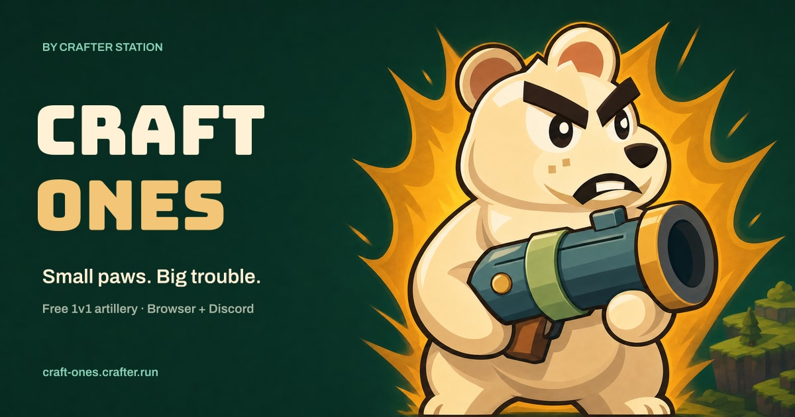

# Craft Ones



Play at [craft-ones.crafter.run](https://craft-ones.crafter.run) or [install on Discord](https://discord.com/oauth2/authorize?client_id=1550283370347634758).

An original 1v1 artillery game by Crafter Station, built with [dotframe](https://github.com/crafter-games/dotframe). Play hot-seat on one screen, or open a room and send the link. Nine characters, six weapons and tools, destructible arenas, 100 HP and 15-second turns.

Runs on the web, as a Discord Activity, natively on macOS, and on iPhone.

## Play
- Mouse: aim with the pointer, hold to charge, release to fire. Keyboard: arrows or WASD to walk and jump, Q/E to aim, F to fire, Tab or 1-7 for tools, C for the ability, M for the map, R for a rematch.
- Touch: drag back on the field like a slingshot and release to fire. Buttons walk, jump and open the map.
- Online: open `?online`, send the link it shows, and the host picks the match.

## Develop
```sh
bun install --frozen-lockfile && (cd port && bun install --frozen-lockfile)
bun test && bun run typecheck && (cd port && bun run test)
cd port && dotframe dev
```

See `AGENTS.md` for the layout, rules and deploy.
